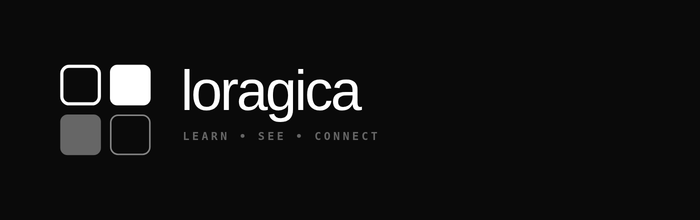

  

  
  
  
   
  
  
   
  
  
  
   
  
  

# Loragica — Interactive Cognitive Simulations & STEM Curriculum

> **Visualize Science, Mathematics, and Computing with Absolute Precision.**
> An open-access interactive laboratory designed to build core scientific intuition, simplify abstract models, and democratize high-fidelity STEM education.

---

## 🌟 Vision & Philosophy

Modern education often separates abstract theoretical equations from physical and visual intuition. **Loragica** is built on the belief that true learning occurs when students can manipulate, stress-test, and observe physical models in real-time. 

By utilizing interactive, lightweight, high-performance web canvas technologies and real-time mathematical engines, Loragica transforms traditional static curricula into an open-access sandbox of discovery.

### Our Core Principles:
- **Zero-Barrier Access**: High-fidelity simulators must remain lightweight and 100% free of tracking, advertisements, or paywalls.
- **Cognitive Cohesion**: Academic subjects are not isolated islands. Mathematical formulas translate directly to electromagnetic wave patterns, which in turn govern physical kinetic geometry.
- **High-Retention Design**: Swapping static textbook diagrams for dynamic micro-feedback loops yields **3.4x higher memory retention** and a deeper, intuitive grasp of complex systems.

---

## 🧭 Curricular Modules & Simulators

Loragica features three core interactive simulators, each engineered to make abstract scientific principles tangible:

### 1. Interactive Cognitive Map
A structural graph visualizing the natural hierarchy and deep interconnections of STEM knowledge paths.
* **Structural Paths**: Graphically connects Mathematics (Calculus, Linear Algebra), Physics (Wave Mechanics, Kinematics), and Computer Science (Algorithmic Logic).
* **High-Fidelity Feedback**: Offers immediate interactive hover states and descriptive insights to bridge conceptual gaps across disciplines.

### 2. Kinetic Geometry Sandbox
An interactive, browser-native physical environment demonstrating vector mechanics, tension wires, and coordinate constraints.
* **Vector Tensors**: Drag and manipulate shape vertices in real-time while dynamic vector lines calculate tension and distance instantly.
* **CAD Blueprint Layout**: Styled with a classic precision technical grid, featuring live floating coordinate readouts and spring-force physics simulation.

### 3. Wave & Frequency Visualizer
A high-performance interactive waveform generator simulating mathematical oscillations and signal synthesis.
* **Flexible Waveforms**: Cycle instantly between Sine, Square, and Sawtooth frequency wave shapes.
* **Multi-Channel Integration**: Add, subtract, and isolate individual channel frequencies to observe constructive and destructive wave interference.

---

## 👥 Empowering Global Contributors

Loragica is a collaborative, collective initiative. Through our **Contributor Hub**, we encourage educators, developers, researchers, and science communicators to expand the interactive curriculum:

* **Open-Source Core**: Structured with modern React and Tailwind CSS to ensure that interactive educational material remains permanently open-source and free for all.
* **Modular Codebase**: Easily extend the platform by adding custom vector equations, novel canvas-drawn wave shapes, or new knowledge nodes.

---

## ⚖️ Legal & Ethical Commitments

Loragica is fully committed to absolute user privacy and data transparency. Our core policy documents are open and transparent:
- **[Privacy Policy]**: Zero track cookies, zero advertising networks, absolute security.
- **[Terms of Service]**: Fair participation guidelines and open distribution structures.
- **[Trademark Policy]**: Protecting the integrity, naming, and identity of Loragica.

---

© 2026 Loragica. Empowering universal scientific literacy through intuitive visualization.
